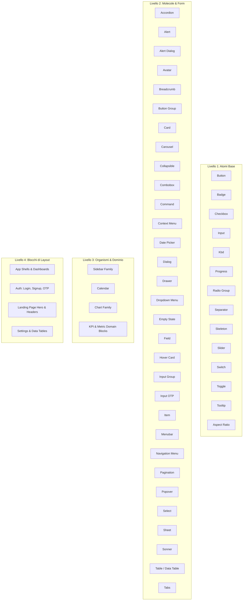

# Figma Component Registry & AI Implementation Guide

> **Source of Truth:** Figma File `shadcn/ui kit for Figma + Pro Blocks - March 2026 (Copy)` (File Key: `pu2nlKYplmTCtTs0FVELdw`)  
> **Architettura Token di Riferimento:** `src/tokens/tokens.css` (Layer 1: `primitives.css`, Layer 2: `semantic.css`, Layer Tipografico: `typography.css`, Layer 3: `theme.css`, Layer 4: `responsive.css`)  
> **Scopo:** Questo documento costituisce il **Registro di Contesto Primario** per l'AI. Durante la prototipazione o la generazione di codice frontend, l'AI DEVE aderire rigidamente a queste specifiche, senza inventare classi arbitrarie, tag impropri o valori hardcoded.

---

## Architettura & Sincronizzazione Token Figma (Rianalisi Settembre 2026)

Dalla rianalisi completa delle 5 collection e delle 14 tabelle dello Style Guide (`21275:6`) eseguita a Settembre 2026, il sistema è organizzato su **858 variabili native Figma**:

1. **TailwindCSS (496 variabili, modo `Default`):** Layer 1 Primitivo (`src/tokens/primitives.css`). Spacing (35), Width/Height/Min/Max (95), Breakpoints (5: 640px, 768px, 1024px, 1280px, 1536px), Radii (10: 0px, 2px, 6px, 8px, 10px, 14px, 18px, 22px, 26px, 9999px), Opacity (21), Line-heights (20), Palette cromatica raw oklch/hex (289). Non usati direttamente nei componenti.
2. **Theme (247 variabili, modo `Default`):** Layer 2 Semantico (`src/tokens/semantic.css`). 76 coppie light/dark per colori base e di stato, font (3), breakpoints (5), containers (13), scale tipografiche (26), pesi (9), radius semantici (8), ombre/blur (107).
   - *Allineamenti specifici:*
     - `--colors-info-light`: `var(--tw-color-blue-600)` (`#2563eb`) per separazione netta dal `--primary` (`sky-600` `#0284c7`).
     - `--colors-info-dark`: `var(--tw-color-blue-400)`.
     - `--colors-chart-1-dark`: `var(--tw-color-blue-700)` (`#1d4ed8`).
     - `--colors-sidebar-primary-dark`: `var(--tw-color-blue-700)` (`#1d4ed8`).
3. **Mode (84 variabili, modi `Light`, `Dark`):** Layer 3 Mode-Switching (`src/tokens/theme.css`). Risolve i token attivi per `:root`, `[data-theme="dark"]` e `.dark`. Include 22 ruoli semantici base, 10 overlay alpha (`--alpha-5` .. `--alpha-90`), 7 token sidebar, 5 serie grafici, 6 stati di feedback (`success`, `warning`, `info`).
4. **Custom (26 variabili, modi `Desktop`, `Mobile`):** Layer 4 Responsive (`src/tokens/responsive.css`). Scale heading-xl..sm (20) e layout spacing (6) differenziati per breakpoint (`container-padding-x`, `section-padding-y`, `section-title-gap-*`).
5. **Icon Library (5 variabili):** Feature flags booleani di libreria (Lucide, Tabler, HugeIcons, Phosphor, Remix).

---

## Indice Rapido dei Componenti

---

# Sezione 1: Atomi Base

---

### 1.1 Button
- **Nome Esatto Figma & Categoria:** `Button` | Atomo Base (Interactive Action)
- **Scopo & Contesto d'Uso (AI Guidance):**
  - *Quando utilizzarlo:* Per triggerare azioni immediate dell'utente (salvataggi, invio form, aperture modali, conferme).
  - *Quando NON utilizzarlo:* Non usare per la navigazione ipertestuale tra URL differenti (usare `<a>` o link component). Non usare per commutare stati binari persistenti (usare `Switch` o `Toggle`).
  - *Relazione con altri componenti:* Accetta icone all'inizio (`icon-start`) o alla fine (`icon-end`). Può essere assemblato in `ButtonGroup`. Funziona da trigger per `Dialog`, `DropdownMenu`, `Sheet`, `Popover`.
- **Varianti & Proprietà:**
  - `variant`: `primary` | `secondary` | `destructive` | `outline` | `ghost` | `link`
  - `size`: `xs` (28px) | `sm` (32px) | `default` (40px) | `lg` (48px) | `icon` (quadrato 36x36px o 40x40px)
  - `state`: `default` | `hover` | `focus` | `active` (pressed) | `disabled` | `loading`
  - `icon-start`: boolean | `icon-end`: boolean | `loading`: boolean
- **Token & Stili Associati (`src/tokens/`):**
  - Sfondi: `var(--primary)`, `var(--secondary)`, `var(--destructive)`, `transparent`
  - Testo: `var(--primary-foreground)`, `var(--secondary-foreground)`, `var(--destructive-foreground)`, `var(--foreground)`
  - Bordi & Radii: `var(--border)`, `var(--radius-md)`
  - Focus Ring: `var(--shadow-focus)`, `var(--shadow-focus-destructive)`
  - Tipografia: `var(--font-sans)`, `var(--text-sm-font-size)`, `var(--font-weight-medium)`
  - Spaziatura: `padding: var(--tw-space-2) var(--tw-space-4); gap: var(--tw-space-2);`
- **Standard HTML & Accessibilità (A11Y):**
  - Tag: `<button type="button">` (o `type="submit"` nei form).
  - ARIA: Quando disabilitato usare attributo HTML `disabled`. In caricamento aggiungere `aria-busy="true"` e `aria-disabled="true"`.
  - Se variante `icon` senza etichetta visibile: `aria-label="Descrizione azione"` obbligatorio.
  - Tastiera: Attivabile con `Enter` e `Space`. Focus solo con `:focus-visible`.
- **Edge Cases & Vincoli di Layout:**
  - Testo: `white-space: nowrap`. Se inserito in flex compresso, applicare `min-width: 0` e `text-overflow: ellipsis`.
  - Icone: `flex-shrink: 0; width: 1rem; height: 1rem; pointer-events: none;`.
  - Mobile Touch: Tap target minimo 44×44px su schermi touch.

---

### 1.2 Badge & BadgeNumber
- **Nome Esatto Figma & Categoria:** `Badge` & `BadgeNumber` | Atomo Base (Status Indicator)
- **Scopo & Contesto d'Uso (AI Guidance):**
  - *Quando utilizzarlo:* Per etichettare lo stato di un record (es. "Attivo", "In Sospeso", "Bozza"), categorie, metadati veloci o contatori numerici (`BadgeNumber`).
  - *Quando NON utilizzarlo:* Non usare come pulsante di azione o link a meno che non sia esplicitamente un badge interattivo rimovibile con icona "x".
  - *Relazione con altri componenti:* Appare all'interno di `Table`, `CardHeader`, `AvatarBadge`, `Sidebar` item.
- **Varianti & Proprietà:**
  - `variant`: `default` | `secondary` | `destructive` | `outline` | `success` | `warning` | `info`
  - `size`: `sm` | `default` | `lg`
  - `shape`: `rounded` (pillola standard) | `square` (angoli retti mitigati)
- **Token & Stili Associati (`src/tokens/`):**
  - Sfondi: `var(--primary)`, `var(--secondary)`, `var(--destructive)`, `var(--success)` (success), `var(--warning)` (warning), `var(--info)` (info)
  - Bordi & Radii: `var(--radius-full)`, `border: 1px solid transparent` (o `var(--border)` per outline)
  - Tipografia: `var(--text-xs-font-size)`, `var(--font-weight-semibold)`, `line-height: 1`
  - Spaziatura: `padding: var(--tw-space-0-5) var(--tw-space-2-5);`
- **Standard HTML & Accessibilità (A11Y):**
  - Tag: `` o `
`.
  - ARIA: Se veicola informazioni critiche di stato, assicurarsi che il testo sia leggibile dagli screen reader. Nel caso di badge solo iconico/cromatico, includere `Stato: Attivo`.
- **Edge Cases & Vincoli di Layout:**
  - Troncamento: I badge non devono mai andare a capo (`white-space: nowrap`). Mantenere le etichette sintetiche (1-2 parole max).

---

### 1.3 Checkbox & CheckboxGroup
- **Nome Esatto Figma & Categoria:** `Checkbox` | Atomo Base (Selection Control)
- **Scopo & Contesto d'Uso (AI Guidance):**
  - *Quando utilizzarlo:* Per selezionare uno o più elementi indipendenti da un elenco o per consensi binari (es. "Accetto i termini e condizioni").
  - *Quando NON utilizzarlo:* Non usare quando solo un'opzione mutuamente esclusiva può essere selezionata tra molte (usare `RadioGroup`).
  - *Relazione con altri componenti:* Spesso raggruppato in `CheckboxGroup`, usato nelle righe di selezione di `Table` / `DataTable` o all'interno di `Field`.
- **Varianti & Proprietà:**
  - `state`: `unchecked` | `checked` | `indeterminate` | `disabled`
  - `size`: `sm` (16x16px) | `default` (18x18px)
- **Token & Stili Associati (`src/tokens/`):**
  - Sfondo & Bordo unchecked: `background: transparent; border: 1px solid var(--input);`
  - Sfondo checked/indeterminate: `background: var(--primary); border-color: var(--primary);`
  - Icona di spunta: `color: var(--primary-foreground);`
  - Radius: `var(--radius-xs)` o `var(--radius-sm)`
  - Focus Ring: `box-shadow: var(--shadow-focus);`
- **Standard HTML & Accessibilità (A11Y):**
  - Tag: `<input type="checkbox">` stilizzato o `<button role="checkbox">`.
  - ARIA: `aria-checked="true|false|mixed"`. Attributo `disabled` se inattivo.
  - Associazione obbligatoria con `<label for="id">`.
  - Tastiera: Spazio per alternare tra checked e unchecked.
- **Edge Cases & Vincoli di Layout:**
  - Allineamento: Deve essere allineato verticalmente al centro rispetto alla prima riga di testo della label (`align-items: flex-start` con piccolo margin-top).

---

### 1.4 Input (Default, Password, File)
- **Nome Esatto Figma & Categoria:** `Input` | Atomo Base (Data Entry)
- **Scopo & Contesto d'Uso (AI Guidance):**
  - *Quando utilizzarlo:* Per consentire all'utente di inserire testo a riga singola (nomi, email, password, numeri, percorsi file).
  - *Quando NON utilizzarlo:* Per testi lunghi multiriga (usare `Textarea`). Per date/orari formattati (usare `DatePicker`).
  - *Relazione con altri componenti:* Nucleo centrale di `Field` e `InputGroup`.
- **Varianti & Proprietà:**
  - `type`: `text` | `email` | `password` | `number` | `file` | `search`
  - `size`: `sm` (32px) | `default` (40px) | `lg` (48px)
  - `state`: `default` | `hover` | `focus` | `disabled` | `error` (invalid)
- **Token & Stili Associati (`src/tokens/`):**
  - Sfondo: `var(--background)`
  - Bordo: `1px solid var(--input)` (in hover: `var(--border)`, in error: `var(--destructive)`)
  - Testo & Placeholder: `color: var(--foreground); placeholder: var(--muted-foreground);`
  - Radius: `var(--radius-md)`
  - Focus Ring: `var(--shadow-focus)`
  - Spaziatura: `padding: var(--tw-space-2) var(--tw-space-3);`
- **Standard HTML & Accessibilità (A11Y):**
  - Tag: `<input>` nativo.
  - ARIA: `aria-invalid="true"` in caso di errore di validazione. `aria-describedby` collegato all'id del messaggio di aiuto o di errore.
  - Tastiera: Supporto completo ai tasti di navigazione testo, `Tab` per entrare/uscire.
- **Edge Cases & Vincoli di Layout:**
  - Testo molto lungo: Deve scorrere orizzontalmente all'interno del campo senza rompere la larghezza del contenitore.
  - Mobile Safari: Usare font-size minima di 16px (`1rem`) per evitare lo zoom automatico indesiderato di iOS.

---

### 1.5 Kbd & KbdGroup
- **Nome Esatto Figma & Categoria:** `Kbd` & `KbdGroup` | Atomo Base (Keyboard Indicator)
- **Scopo & Contesto d'Uso (AI Guidance):**
  - *Quando utilizzarlo:* Per indicare una scorciatoia da tastiera (es. `⌘K`, `Ctrl+S`, `Esc`) all'interno di pulsanti, voci di menu o documentazione.
  - *Quando NON utilizzarlo:* Non usare come elemento interattivo cliccabile primario.
  - *Relazione con altri componenti:* All'interno di `CommandDialog`, `DropdownMenuItem`, `Tooltip`.
- **Varianti & Proprietà:**
  - `size`: `sm` | `default`
- **Token & Stili Associati (`src/tokens/`):**
  - Sfondo: `var(--muted)`
  - Bordo: `1px solid var(--border)`
  - Testo: `color: var(--muted-foreground); font-family: var(--font-mono); font-size: var(--text-xs-font-size);`
  - Radius: `var(--radius-sm)`
  - Spaziatura: `padding: var(--tw-space-0-5) var(--tw-space-1-5);`
- **Standard HTML & Accessibilità (A11Y):**
  - Tag: `<kbd>`.
  - ARIA: Fornire `aria-label="Comando K"` se il simbolo UTF-8 non è pronunciabile dagli screen reader.

---

### 1.6 Progress
- **Nome Esatto Figma & Categoria:** `Progress` | Atomo Base (Feedback Indicator)
- **Scopo & Contesto d'Uso (AI Guidance):**
  - *Quando utilizzarlo:* Per mostrare il completamento di un'operazione determinata (da 0% a 100%) o lo stato di avanzamento di un processo a step.
  - *Quando NON utilizzarlo:* Per attese indeterminate senza percentuale nota (usare `Spinner` o `Skeleton`).
  - *Relazione con altri componenti:* All'interno di card di caricamento, wizard o barre di avanzamento attività.
- **Varianti & Proprietà:**
  - `variant`: `default` | `success` | `destructive` | `warning`
  - `value`: numerico `0..100`
- **Token & Stili Associati (`src/tokens/`):**
  - Traccia (Track): `background-color: var(--secondary); border-radius: var(--radius-full); height: var(--tw-space-2);`
  - Indicatore (Indicator): `background-color: var(--primary); transition: width 300ms ease;`
- **Standard HTML & Accessibilità (A11Y):**
  - Tag: `
` o tag `<progress>`.

---

### 1.7 Radio Group & RadioButton
- **Nome Esatto Figma & Categoria:** `Radio Group` | Atomo Base (Exclusive Selection)
- **Scopo & Contesto d'Uso (AI Guidance):**
  - *Quando utilizzarlo:* Per consentire all'utente di selezionare esattamente una sola opzione tra un set ridotto di alternative visibili (2-5 opzioni).
  - *Quando NON utilizzarlo:* Per più di 5 opzioni (usare `Select` o `Combobox`). Per selezioni multiple indipendenti (usare `Checkbox`).
- **Varianti & Proprietà:**
  - `state`: `unselected` | `selected` | `disabled`
- **Token & Stili Associati (`src/tokens/`):**
  - Bordo: `1px solid var(--input)` (selected: `var(--primary)`)
  - Pallino interno: `background-color: var(--primary); border-radius: var(--radius-full);`
  - Focus Ring: `box-shadow: var(--shadow-focus);`
- **Standard HTML & Accessibilità (A11Y):**
  - Tag: `
` contenente `<input type="radio">` o `<button role="radio">`.
  - Tastiera: Frecce Direzionali (`Up`/`Down`/`Left`/`Right`) per scorrere tra i radio button; selezione automatica.

---

### 1.8 Separator
- **Nome Esatto Figma & Categoria:** `Separator` | Atomo Base (Structural Divider)
- **Scopo & Contesto d'Uso (AI Guidance):**
  - *Quando utilizzarlo:* Per separare visivamente o semanticamente sezioni di contenuto o gruppi di voci di menu.
  - *Varianti:* `orientation`: `horizontal` | `vertical`
- **Token & Stili Associati:** `background-color: var(--border);` (h: 1px per horizontal, w: 1px per vertical).
- **A11Y:** `
` nativo o `
`.

---

### 1.9 Skeleton
- **Nome Esatto Figma & Categoria:** `Skeleton` | Atomo Base (Loading State)
- **Scopo & Contesto d'Uso (AI Guidance):**
  - *Quando utilizzarlo:* Per mimare la silhouette del contenuto prima che i dati siano caricati (riduce il layout shift cumulativo CLS).
  - *Varianti:* `type`: `text` | `avatar` (cerchio) | `card` | `table-row`
- **Token & Stili Associati:** `background-color: var(--muted); border-radius: var(--radius-md); animation: pulse 2s cubic-bezier(0.4, 0, 0.6, 1) infinite;`
- **A11Y:** `aria-hidden="true"` sul contenitore skeleton, con un contenitore padre che dichiara `aria-busy="true"`.

---

### 1.10 Slider
- **Nome Esatto Figma & Categoria:** `Slider` | Atomo Base (Range Input)
- **Scopo & Contesto d'Uso:** Per selezionare un valore numerico continuo o discreto all'interno di un intervallo (es. volume, budget, allocazione CPU).
- **Token & Stili Associati:** Track: `var(--secondary)`. Range: `var(--primary)`. Thumb: `var(--background)`, border: `2px solid var(--primary)`, `box-shadow: var(--shadow-sm)`.
- **A11Y:** `<input type="range">` o elemento con `role="slider" aria-valuemin="..." aria-valuemax="..." aria-valuenow="..."`.

---

### 1.11 Switch & SwitchGroup
- **Nome Esatto Figma & Categoria:** `Switch` | Atomo Base (Toggle Control)
- **Scopo & Contesto d'Uso:** Per commutare istantaneamente uno stato on/off che ha effetto immediato senza richiedere il salvataggio di un form.
- **Token & Stili Associati:** Track on: `var(--primary)`. Track off: `var(--input)`. Thumb: `var(--background)`.
- **A11Y:** `<button role="switch" aria-checked="true|false">`. Spazio per commutare.

---

### 1.12 Toggle
- **Nome Esatto Figma & Categoria:** `Toggle` | Atomo Base (Two-state Button)
- **Scopo & Contesto d'Uso:** Pulsante che rimane "premuto" per attivare o disattivare una proprietà (es. Grassetto, Corsivo, modalità griglia).
- **Token & Stili Associati:** On: `background-color: var(--accent); color: var(--accent-foreground);`. Off: `ghost`.
- **A11Y:** `<button aria-pressed="true|false">`.

---

### 1.13 Tooltip
- **Nome Esatto Figma & Categoria:** `Tooltip` | Atomo Base (Contextual Overlay)
- **Scopo & Contesto d'Uso:** Breve testo esplicativo non interattivo che appare al passaggio del mouse o al focus da tastiera su un elemento. Non inserire testo lungo o elementi cliccabili.
- **Token & Stili Associati:** Sfondo: `var(--primary)`. Testo: `var(--primary-foreground)`. Radius: `var(--radius-sm)`. Ombra: `var(--shadow-md)`.
- **A11Y:** `role="tooltip"`, collegato al trigger via `aria-describedby="tooltip-id"`. Scompare alla pressione di `Escape`.

---

### 1.14 Aspect Ratio
- **Nome Esatto Figma & Categoria:** `Aspect Ratio` | Atomo Base (Container Helper)
- **Scopo & Contesto d'Uso:** Mantenere un rapporto di forma costante per immagini, mappe, anteprime video o canvas (es. `16/9`, `4/3`, `1/1`).
- **Token & Stili Associati:** CSS nativo `aspect-ratio: 16 / 9; width: 100%; overflow: hidden;`.

---

# Sezione 2: Molecole, Form & Controlli Composti

---

### 2.1 Accordion & AccordionItem
- **Nome Esatto Figma & Categoria:** `Accordion` | Molecola (Disclosure Control)
- **Scopo & Contesto d'Uso:** Organizzare informazioni secondarie, sezioni di configurazione articolate o FAQ riducendo l'ingombro verticale di pagina mediante sezioni animate espandibili e comprimibili, con supporto a selezione singola o multipla.
- **Struttura & Slot Contract:**
  - `.accordion`: Contenitore principale a blocco (`width: 100%`).
  - `.accordion-item`: Singola riga o sezione comprimibile con bordo divisore (`border-bottom: 1px solid var(--border)`).
  - `.accordion-trigger`: Pulsante accessibile a larghezza piena (`display: flex; align-items: center; justify-content: space-between; width: 100%; padding: var(--tw-space-4) 0; font-size: 0.875rem; font-weight: 500; color: var(--foreground); background: transparent; border: none; cursor: pointer`).
  - `.accordion-chevron`: Icona SVG a freccia integrata con rotazione automatica all'apertura (`transition: transform 200ms cubic-bezier(0.16, 1, 0.3, 1)`). In stato `[data-state="open"]` applica `transform: rotate(180deg)`.
  - `.accordion-content`: Pannello contenitore a scomparsa (`overflow: hidden; font-size: 0.8125rem; color: var(--muted-foreground); line-height: 1.5; padding-bottom: var(--tw-space-4)`).
  - Stati CSS reattivi: `[data-state="open"]` (aperto e visibile) e `[data-state="closed"]` (compresso con `display: none` o altezza zero).
- **Token Associati:**
  - Bordo divisore: `1px solid var(--border)` (`oklch(0.92 0.005 264)` in Light Mode)
  - Testo trigger: `var(--foreground)` (`oklch(0.14 0.005 285)`)
  - Testo contenuto: `var(--muted-foreground)` (`oklch(0.55 0.015 285)`)
  - Focus Ring: `outline: 2px solid var(--ring); outline-offset: 2px`
- **Accessibilità & WCAG 2.2 AA (WCAG 1.3.1, 2.1.1, 4.1.2):**
  - Trigger impostato obbligatoriamente come `<button aria-expanded="true|false" aria-controls="[content-id]">`.
  - Contenuto associato con `id="[content-id]"` e `role="region" aria-labelledby="[trigger-id]"`.
  - Navigazione da tastiera: `Enter` o `Space` attivano il trigger; `Tab` attraversa sequenzialmente i trigger senza intrappolare il focus.
  - Contrasto cromatico minimo verificato 4.5:1 sia per lo stato chiuso che aperto.

---

### 2.1b Collapsible (Inline Expandable Card)
- **Nome Esatto Figma & Categoria:** `Collapsible` | Molecola (Inline Disclosure)
- **Scopo & Contesto d'Uso:** Fornire un pannello isolato (card o riga di impostazione) con trigger di espansione per mostrare/nascondere metadati avanzati, token di sicurezza o configurazioni opzionali senza la sequenzialità dell'accordion.
- **Struttura & Slot Contract:**
  - `.collapsible`: Wrapper card con bordo perimetrale e padding (`border: 1px solid var(--border); border-radius: var(--radius-lg); background: var(--card)`).
  - `.collapsible-trigger`: Elemento interattivo o bottone dedicato (`.btn .btn-outline .btn-xs`) collegato allo stato `aria-expanded`.
  - `.collapsible-content`: Area dati con transizione di altezza o visibilità condizionale `[data-state="open|closed"]`.
- **Token Associati:**
  - Sfondo card: `var(--card)`
  - Bordo card: `var(--border)`
  - Spaziatura: `var(--tw-space-3)` (12px) e `var(--tw-space-4)` (16px)
- **Accessibilità & WCAG 2.2 AA:**
  - Trigger esplicito con `aria-expanded="true|false"` e indicazione chiara del cambiamento di stato ("Mostra Dettagli" / "Nascondi Dettagli").

---

### 2.2 Alert
- **Nome Esatto Figma & Categoria:** `Alert` | Molecola (Status Banner)
- **Scopo & Contesto d'Uso:** Messaggio di rilievo contestuale di pagina (informazioni di sistema, avvisi di sicurezza, conferme).
- **Varianti:** `default` | `destructive` | `success` | `warning` | `info`.
- **Token:** Bordo: `1px solid var(--border)` (o `var(--destructive)`). Sfondo: `var(--card)`. Icona & Titolo: `var(--foreground)` (o rispettivo colore semantico).
- **A11Y:** `role="alert"` per errori/avvisi critici, oppure `role="status"` per informazioni non bloccanti.

---

### 2.3 Alert Dialog
- **Nome Esatto Figma & Categoria:** `Alert Dialog` | Molecola (Blocking Modal)
- **Scopo & Contesto d'Uso:** Modale bloccante per azioni distruttive irreversibili (es. "Eliminare questo database?", "Revocare credenziali root?"). Richiede conferma esplicita o annullamento prioritario.
- **Struttura & Slot Contract:**
  - `.alert-dialog-overlay`: Backdrop oscurato con `color-mix(in oklch, var(--background) 80%, transparent)` e `backdrop-filter: var(--backdrop-filter-xs)`.
  - `.alert-dialog-content`: Finestra centrata (`position: fixed; left: 50%; top: 50%; transform: translate(-50%, -50%)`).
  - `.alert-dialog-header`: Intestazione contenente `.alert-dialog-title` e `.alert-dialog-description`.
  - `.alert-dialog-footer`: Accetta **esclusivamente** la coppia di bottoni:
    1. `.btn-outline` ("Annulla Operazione" - **focus iniziale obbligatorio**).
    2. `.btn-destructive` ("Elimina Definitivamente" - azione irreversibile).
- **Token Associati:** Sfondo: `var(--background)`. Testo: `var(--foreground)`. Bordo: `1px solid var(--border)`. Radius: `var(--radius-xl)` (12px). Ombra: `var(--shadow-xl)`. Animazione: `modal-scale-in 150ms cubic-bezier(0.16, 1, 0.3, 1)`.
- **A11Y (WCAG 2.2 AA):**
  - Obbligatorio: `role="alertdialog"`, `aria-modal="true"`, `aria-labelledby="alert-dialog-title"`, `aria-describedby="alert-dialog-desc"`.
  - **Focus Trap:** All'apertura il focus è vincolato internamente. Il focus iniziale DEVE posizionarsi sul pulsante "Annulla" per impedire conferme accidentali con tasto `Enter`. Tasto `Escape` annulla e chiude la finestra.
  - **Scroll Lock:** All'apertura viene applicato `overflow: hidden` al `<body>`.

---

### 2.4 Avatar, AvatarBadge & AvatarGroup
- **Nome Esatto Figma & Categoria:** `Avatar` | Molecola (User Identity)
- **Scopo & Contesto d'Uso:** Mostrare l'immagine profilo dell'utente, fallback testuale (iniziali) o badge di stato online/idle/busy.
- **Token:** Radius: `var(--radius-full)`. Bordo: `border: 2px solid var(--background)`. Fallback bg: `var(--muted)`.
- **A11Y:** `` con `alt="Nome Utente"` oppure se fallback testo: `aria-label="Iniziali di Nome Utente"`.

---

### 2.5 Breadcrumb & BreadcrumbItem
- **Nome Esatto Figma & Categoria:** `Breadcrumb` | Molecola (Navigation Trail)
- **Scopo & Contesto d'Uso:** Fornire un percorso gerarchico di navigazione secondario che indica la posizione della pagina corrente nella tassonomia dell'applicazione o del sito, consentendo di risalire agevolmente ai livelli superiori.
- **Struttura & Slot Contract:**
  - `.breadcrumb`: Elemento `<nav aria-label="Percorso di navigazione">` contenitore.
  - `.breadcrumb-list`: Lista ordinata semantica `<ol>` (`display: flex; flex-wrap: wrap; align-items: center; gap: var(--tw-space-1-5) [6px]; list-style: none; margin: 0; padding: 0; font-size: 0.875rem`).
  - `.breadcrumb-item`: Singola voce o nodo gerarchico `<li>` (`display: inline-flex; align-items: center; gap: var(--tw-space-1-5)`).
  - `.breadcrumb-link`: Collegamento interattivo verso livelli padre (`color: var(--muted-foreground); text-decoration: none; transition: color 150ms ease; font-weight: 400`). Hover: `color: var(--foreground)`.
  - `.breadcrumb-page`: Testo non cliccabile della pagina corrente (`color: var(--foreground); font-weight: 500; pointer-events: none`).
  - `.breadcrumb-separator`: Divisore visivo (slash `/` o icona chevron `aria-hidden="true"`, colore `var(--muted-foreground); opacity: 0.7`).
  - `.breadcrumb-ellipsis`: Pulsante o indicatore di compressione (`...`) per percorsi lunghi (`display: inline-flex; align-items: center; justify-content: center; width: 1.5rem; height: 1.5rem; border-radius: var(--radius-sm); color: var(--muted-foreground)`).
- **Token Associati:**
  - Colore link passivi: `var(--muted-foreground)` (`oklch(0.55 0.015 285)`)
  - Colore hover e pagina corrente: `var(--foreground)` (`oklch(0.14 0.005 285)`)
  - Spaziatura nodi: `var(--tw-space-1-5)` (6px) o `var(--tw-space-2)` (8px)
  - Focus Ring su link: `outline: 2px solid var(--ring); outline-offset: 2px; border-radius: var(--radius-xs)`
- **Accessibilità & WCAG 2.2 AA (WCAG 1.3.1, 2.4.8, 3.2.3):**
  - Obbligatorio l'uso di `<nav aria-label="...">` e struttura ordinata `<ol>`.
  - La pagina corrente terminale DEVE contenere l'attributo `aria-current="page"`.
  - I caratteri separatori sono marcati con `aria-hidden="true"` per evitare letture ridondanti negli screen reader.
  - La variante compressa include pulsante espandibile con etichetta `aria-label="Mostra nodi percorso nascosti"`.

---

### 2.6 Card
- **Nome Esatto Figma & Categoria:** `Card` | Molecola (Content Container)
- **Scopo & Contesto d'Uso:** Contenitore principale per raggruppare informazioni correlate, metriche, widget di dashboard o elenchi.
- **Struttura:**
  - `CardHeader`: Spaziatura verticale per titolo e descrizione.
  - `CardTitle`: Tipografia `--font-heading-sm` o `--text-lg-font-size; font-weight: var(--font-weight-semibold)`.
  - `CardDescription`: Tipografia `--text-sm-font-size; color: var(--muted-foreground)`.
  - `CardContent`: Area corpo principale.
  - `CardFooter`: Azioni secondarie e bottoni allineati a destra/sinistra.
- **Token:** Sfondo: `var(--card)`. Bordo: `1px solid var(--border)`. Radius: `var(--radius-xl)`. Ombra: `var(--shadow-sm)`. Spaziatura interna: `padding: var(--tw-space-6)`.

---

### 2.7 Carousel
- **Nome Esatto Figma & Categoria:** `Carousel` | Molecola (Horizontal Slider)
- **Scopo & Contesto d'Uso:** Scorrere sequenzialmente schede, immagini o recensioni.
- **A11Y:** `role="region" aria-roledescription="carousel"`. Pulsanti prev/next con etichette chiare. Supporto allo swipe touch e frecce da tastiera.

---

### 2.8 Combobox & MultiSelect
- **Nome Esatto Figma & Categoria:** `Combobox` | Molecola (Filterable Selection & Multi-Tagging)
- **Scopo & Contesto d'Uso:** Selezionare uno o più valori da un elenco esteso (più di 15 elementi) tramite ricerca incrementale e digitazione in tempo reale. Nella variante multi-selezione, incapsula le voci scelte all'interno di pillole rimovibili (`.badge-secondary` con pulsante dismiss contestuale).
- **Struttura & Slot Contract:**
  - `.combobox`: Wrapper posizionale (`position: relative; width: 100%`).
  - `.combobox-trigger`: Pulsante di attivazione (`display: flex; align-items: center; justify-content: space-between; height: 2.5rem / 40px; padding: 0 0.75rem; border: 1px solid var(--border); border-radius: var(--radius-md); background: var(--card)`).
  - `.combobox-tags`: Contenitore flessibile di tag per multi-selezione (`display: flex; flex-wrap: wrap; gap: 0.25rem; align-items: center`).
  - `.combobox-content`: Pannello menu fluttuante (`position: absolute; top: calc(100% + 4px); width: 100%; border: 1px solid var(--border); border-radius: var(--radius-lg); background: var(--popover); box-shadow: var(--shadow-md); z-index: 50; overflow: hidden`).
  - `.combobox-search-wrapper`: Intestazione del pannello con icona lente SVG e input di digitazione (`display: flex; align-items: center; gap: 0.5rem; padding: 0.5rem 0.75rem; border-bottom: 1px solid var(--border)`).
  - `.combobox-search-input`: Campo di ricerca senza bordo (`border: none; outline: none; background: transparent; width: 100%; font-size: 0.8125rem`).
  - `.combobox-list`: Contenitore a scorrimento verticale con voci opzioni (`max-height: 15rem / 240px; overflow-y: auto; padding: 0.25rem`).
  - `.combobox-item`: Singola riga opzione (`display: flex; align-items: center; justify-content: space-between; padding: 0.375rem 0.625rem; border-radius: var(--radius-sm); font-size: 0.8125rem; cursor: pointer; transition: background 150ms ease`).
  - `.combobox-empty`: Feedback di nessun risultato trovato (`padding: 1rem; text-align: center; font-size: 0.75rem; color: var(--muted-foreground)`).
- **Token Associati:**
  - Sfondo e bordi: `var(--popover)`, `var(--popover-foreground)`, `var(--border)`
  - Voce hover: `background-color: var(--accent); color: var(--accent-foreground)`
  - Ombreggiatura: `var(--shadow-md)` (elevazione di terzo livello)
  - Pillole multi-select: `.badge.badge-secondary` (`background: var(--secondary); color: var(--secondary-foreground)`)
- **Accessibilità & WCAG 2.2 AA (WCAG 1.3.1, 2.1.1, 4.1.2):**
  - Trigger configurato con `role="combobox"`, `aria-expanded="true|false"`, `aria-haspopup="listbox"` e `aria-controls="combobox-list-id"`.
  - La lista adotta `role="listbox"`, con ogni voce `role="option"` e `aria-selected="true|false"`.
  - Navigazione da tastiera: `ArrowDown`/`ArrowUp` per scorrere tra le voci visibili, `Enter` per selezionare, `Escape` per chiudere il menu e restituire il focus al trigger.
  - In fase di apertura, il focus viene reindirizzato istantaneamente all'interno di `.combobox-search-input` per consentire la digitazione immediata.

---

### 2.9 Command (Palette)
- **Nome Esatto Figma & Categoria:** `Command` | Molecola (Quick Actions)
- **Scopo & Contesto d'Uso:** Palette di ricerca rapida modale richiamata da scorciatoia (`⌘K` / `Ctrl+K`) per navigare sezioni o lanciare comandi.
- **A11Y:** Focus trap, tasti `ArrowDown`/`ArrowUp` per scorrere, `Enter` per eseguire, `Escape` per chiudere.

---

### 2.10 Dialog (Modal)
- **Nome Esatto Figma & Categoria:** `Dialog` | Molecola (Interactive Overlay)
- **Scopo & Contesto d'Uso:** Finestra modale centrata per flussi operativi multi-campo (creazione record, wizard, integrazioni API) senza perdere la schermata sottostante.
- **Struttura & Slot Contract:**
  - `.dialog-overlay`: Sfondo scuro (`color-mix(in oklch, var(--background) 80%, transparent)`) con `backdrop-filter: var(--backdrop-filter-xs)`.
  - `.dialog-content`: Finestra centrata con `border: 1px solid var(--border)`, `border-radius: var(--radius-xl)` e `box-shadow: var(--shadow-xl)`.
  - `.dialog-close`: Pulsante di chiusura d'angolo in alto a destra (`.btn-ghost.btn-icon.btn-xs` con `aria-label="Chiudi"`).
  - `.dialog-header`: Intestazione contenente `.dialog-title` (`font-weight: 600`) e `.dialog-description` (`color: var(--muted-foreground)`).
  - `.dialog-body`: Area centrale per campi di input, select o informazioni.
  - `.dialog-footer`: Pulsanti di azione (.btn outline / primary).
- **Taglie Proporzionali:**
  - `.dialog-sm`: `max-width: var(--tw-max-w-sm)` (24rem / 384px) - PIN OTP, conferme rapide.
  - `.dialog-md`: `max-width: var(--tw-max-w-lg)` (32rem / 512px) - Form standard (Default).
  - `.dialog-lg`: `max-width: var(--tw-max-w-2xl)` (42rem / 672px) - Wizard a step, layout a 2 colonne.
  - `.dialog-xl`: `max-width: var(--tw-max-w-4xl)` (56rem / 896px) - Data tables, visualizzatori log avanzati.
- **A11Y (WCAG 2.2 AA):**
  - `role="dialog" aria-modal="true" aria-labelledby="dialog-title" aria-describedby="dialog-desc"`.
  - Tasto `Escape` chiude e ripristina il focus sul trigger d'origine.
  - Focus trap con ciclo su `Tab`/`Shift+Tab` ed eliminazione del background scroll (`body.style.overflow = 'hidden'`).

---

### 2.11 Sheet (Slide-Over Panel)
- **Nome Esatto Figma & Categoria:** `Sheet` | Molecola (Slide-Over Panel)
- **Scopo & Contesto d'Uso:** Pannello a comparsa ancorato a uno dei bordi dello schermo, ideale per ispezione dettagli di riga, filtri multicriterio o menu di navigazione mobile (`.sheet-left`).
- **Struttura & Varianti Direzionali:**
  - `.sheet-overlay`: Backdrop oscurato sincronizzato.
  - `.sheet-content`: Pannello fisso con transizione hardware-accelerated (`cubic-bezier(0.16, 1, 0.3, 1)` a 300ms).
  - `.sheet-right` (Default): Ancorato a destra, larghezza `var(--tw-max-w-sm)` (384px), `border-left: 1px solid var(--border)`.
  - `.sheet-left`: Ancorato a sinistra, larghezza 384px, `border-right: 1px solid var(--border)`. Standard per navigazione mobile.
  - `.sheet-top`: Ancorato in alto a tutta larghezza, `border-bottom: 1px solid var(--border)`. Standard per annunci/banner critici.
  - `.sheet-bottom`: Ancorato in basso a tutta larghezza.
- **Slot Interni:** `.sheet-header`, `.sheet-close`, `.sheet-body` (con `overflow-y: auto`), `.sheet-footer`.
- **A11Y:** `role="dialog" aria-modal="true"`, focus trap interno e chiusura con `Escape`.

---

### 2.11b Drawer (Mobile Bottom Sheet)
- **Nome Esatto Figma & Categoria:** `Drawer` | Molecola (Touch Bottom Sheet)
- **Scopo & Contesto d'Uso:** Cassetto ancorato al fondo per display mobile e tablet, ottimizzato per l'interazione ergonomica con il pollice.
- **Struttura:**
  - `.drawer-overlay`: Backdrop oscurato.
  - `.drawer-content`: Pannello inferiore (`max-height: 85vh; border-radius: var(--radius-xl) var(--radius-xl) 0 0`).
  - `.drawer-handle`: Barretta centrale di trascinamento touch (40x4px, `border-radius: var(--radius-full)`).
  - `.drawer-header`, `.drawer-body`, `.drawer-footer`.
- **A11Y:** `role="dialog" aria-modal="true"`, swipe-down dismiss ed escape key listener.

---

### 2.11c Popover (Contextual Floating Panel)
- **Nome Esatto Figma & Categoria:** `Popover` | Molecola (Floating Anchor)
- **Scopo & Contesto d'Uso:** Contenitore fluttuante non bloccante ancorato a un pulsante trigger. Accetta form compatti, slider o elenchi di filtri rapidi.
- **Struttura:**
  - `.popover-wrapper`: Contenitore `relative` inline-flex che funge da punto d'ancoraggio.
  - `.popover-content`: Finestra assoluta (`top: 100%; margin-top: 0.5rem; width: 18rem / 288px`).
  - Modificatori di allineamento: `.popover-right`, `.popover-center`, `.popover-top`.
- **Token:** Sfondo: `var(--popover)`. Testo: `var(--popover-foreground)`. Bordo: `1px solid var(--border)`. Radius: `var(--radius-lg)`. Ombra: `var(--shadow-md)`.
- **A11Y:** Dismiss automatico su click all'esterno (click-outside) e alla pressione del tasto `Escape`.

---

### 2.12 Dropdown Menu & Context Menu
- **Nome Esatto Figma & Categoria:** `Dropdown Menu` | Molecola (Action Menu)
- **Scopo & Contesto d'Uso:** Presentare all'utente un menu compatto e fluttuante di azioni, collegamenti contestuali o opzioni operative attivato al click su un pulsante di trigger o mediante tasto destro del mouse (`Context Menu`).
- **Struttura & Slot Contract:**
  - `.dropdown-menu`: Wrapper relativo posizionale (`position: relative; display: inline-block`).
  - `.dropdown-menu-content`: Finestra fluttuante di livello superiore (`position: absolute; top: calc(100% + 4px); right: 0; min-width: 14rem; background: var(--popover); color: var(--popover-foreground); border: 1px solid var(--border); border-radius: var(--radius-lg); box-shadow: var(--shadow-md); padding: var(--tw-space-1); z-index: 50; display: flex; flex-direction: column; gap: 1px`).
  - `.dropdown-menu-label`: Intestazione o categoria descrittiva non interattiva (`padding: 0.375rem 0.625rem; font-size: 0.6875rem; font-weight: 600; text-transform: uppercase; letter-spacing: 0.05em; color: var(--muted-foreground)`).
  - `.dropdown-menu-item`: Singola riga d'azione interattiva (`display: flex; align-items: center; justify-content: space-between; gap: var(--tw-space-2); padding: 0.375rem 0.625rem; border-radius: var(--radius-sm); font-size: 0.8125rem; color: var(--foreground); text-decoration: none; cursor: pointer; transition: background 150ms ease`). Hover/Focus: `background: var(--accent); color: var(--accent-foreground)`.
  - `.dropdown-menu-item-destructive`: Variante d'azione distruttiva (`color: var(--destructive); &:hover { background: color-mix(in oklch, var(--destructive) 10%, transparent); color: var(--destructive); }`).
  - `.dropdown-menu-shortcut`: Scorciatoia da tastiera allineata a destra (`font-family: var(--font-mono); font-size: 0.6875rem; color: var(--muted-foreground); margin-left: auto`).
  - `.dropdown-menu-separator`: Linea divisoria orizzontale (`height: 1px; background: var(--border); margin: 0.25rem -0.25rem`).
- **Token Associati:**
  - Sfondo menu: `var(--popover)` (`oklch(1 0 0)` in Light, `oklch(0.14 0.005 285)` in Dark)
  - Testo voci: `var(--popover-foreground)`
  - Sfondo stato hover/attivo: `var(--accent)` (`oklch(0.96 0.005 264)`)
  - Bordo: `1px solid var(--border)`
  - Ombreggiatura: `var(--shadow-md)`
  - Azioni distruttive: `var(--destructive)` (`oklch(0.57 0.22 27)`)
- **Accessibilità & WCAG 2.2 AA (WCAG 1.3.1, 2.1.1, 2.4.3, 4.1.2):**
  - Trigger impostato con `aria-haspopup="menu"` e `aria-expanded="true|false"`.
  - Contenitore contrassegnato con `role="menu"` e `aria-orientation="vertical"`.
  - Voci contrassegnate con `role="menuitem"`.
  - Navigazione da tastiera: `ArrowDown`/`ArrowUp` per scorrere ciclicamente le voci attive, `Enter` o `Space` per eseguire l'azione, `Escape` per chiudere istantaneamente il menu riposizionando il focus sul trigger.
  - Dismiss automatico su click all'esterno (click-outside).

---

### 2.13 Empty State
- **Nome Esatto Figma & Categoria:** `Empty` | Molecola (Zero Data Pattern)
- **Scopo & Contesto d'Uso:** Schermata mostrata quando una lista, tabella o ricerca non contiene elementi. Include icona/illustrazione, titolo esplicativo, descrizione e pulsante di azione primaria (es. "Crea nuova risorsa").

---

### 2.14 Field (Form Control Wrapper)
- **Nome Esatto Figma & Categoria:** `Field` | Molecola (Form Unit)
- **Scopo & Contesto d'Uso:** Il wrapper semantico primario e unificato per tutti i controlli interattivi di form. Assicura una composizione consistente tra etichetta visibile (`.field-label`), indicatore di obbligatorietà (`.field-label-required`), campo nativo o molecolare (`Input`, `Select`, `Textarea`, `Checkbox`, `Switch`), testo esplicativo (`.field-description`) e messaggio di errore di validazione animato (`.field-error`).
- **Struttura & Slot Contract:**
  - `.field`: Contenitore flessibile a colonna (`display: flex; flex-direction: column; gap: var(--tw-space-1-5) [0.375rem / 6px]; width: 100%`).
  - `.field-horizontal`: Variante a riga per pannelli impostazioni (`display: flex; flex-direction: row; align-items: center; justify-content: space-between; gap: var(--tw-space-4)`), che incapsula il componente atomico `.checkbox` conforme allo standard di sezione 1.3.1.
  - `.field-label`: Etichetta tipografica (`font-size: var(--text-sm-font-size) [0.875rem]; font-weight: 500; color: var(--foreground); cursor: pointer`). L'etichetta non subisce colorazione d'errore ma mantiene la cromia standard foreground secondo WCAG 3.3.2.
  - `.field-label-required`: Pseudo-elemento `::after` con asterisco rosso semantico (`content: ' *'; color: var(--destructive); margin-left: 0.125rem`).
  - `.field-description`: Testo di supporto ausiliario (`font-size: var(--text-xs-font-size) [0.75rem]; color: var(--muted-foreground); line-height: 1.4`).
  - `.field-error`: Banner di errore animato identico allo stato `is-invalid` di 1.4.3 (`display: flex; align-items: center; gap: 4px; font-size: 0.75rem; color: var(--destructive); font-weight: 400; animation: field-error-slide 150ms ease`).
  - `.input-wrapper`: Wrapper flessibile per campi con azioni incorporate (es. pulsante mostra/nascondi password `.input-action-btn` con icone occhio / occhio sbarrato).
- **Token Associati:**
  - Spaziatura interna: `var(--tw-space-1-5)` (6px tra label, input e helper)
  - Errore di validazione: `var(--destructive)` (OKLCH red), con bordo evidenziato `border-color: var(--destructive)` e ring morbido spesso conforme a Figma `box-shadow: var(--shadow-focus-input-destructive)`
  - Helper text: `var(--muted-foreground)`
  - Success text: colore semantico `#16a34a` (green) per feedback di validazione superata
- **Accessibilità & WCAG 2.2 AA (WCAG 1.3.1, 3.3.1, 3.3.2, 4.1.2):**
  - Associazione deterministica tra etichetta e controllo tramite attributo `for="[input-id]"` su `<label>` corrispondente all'`id` dell'input.
  - Testo informativo collegato via `aria-describedby="[desc-id]"`.
  - In stato di errore, il campo riceve `class="input is-invalid"` e `aria-invalid="true"`, l'`aria-describedby` concatena l'ID del messaggio di errore e `.field-error` include `role="alert"` per consentire l'annuncio immediato alle tecnologie assistive.
  - Validazione password dinamica: verifica in tempo reale la regola ("La password deve contenere almeno 12 caratteri e un simbolo"), commutando reattivamente tra lo stato di errore `.is-invalid` e lo stato di conformità con messaggio positivo.

---

### 2.15 Input Group & Input OTP
- **Nome Esatto Figma & Categoria:** `Input Group` & `Input OTP` | Molecole (Advanced Inputs)
- **Scopo & Contesto d'Uso:**
  - `Input Group`: Concatenazione ottica priva di doppi bordi tra campi di testo e addon prefissi (es. protocolli `https://`, icone lente, valute `€`), suffissi (es. TLD `.internal`, pulsanti d'azione primaria come "Verifica" o "Filtra") o scale dimensionali.
  - `Input OTP`: Serie allineata di caselle numeriche quadrate (4 o 6 cifre) concepita per l'autenticazione a due fattori (2FA/MFA) con cursore pulsante centrale e avanzamento automatico del focus.
- **Struttura & Slot Contract (Input Group):**
  - `.input-group`: Contenitore orizzontale (`display: flex; width: 100%`).
  - `.input-group-addon`: Elemento decorativo o testuale non editabile (`display: flex; align-items: center; padding: 0 0.75rem; background: var(--muted); color: var(--muted-foreground); border: 1px solid var(--border); font-size: 0.8125rem; white-space: nowrap`).
  - Pulsanti integrati (`.btn`): Adottano la variante primaria `.btn-primary` per staccarsi chiaramente dai decoratori passivi e sincronizzano rigidamente la propria altezza a quella del campo adiacente (`height: 2.5rem` / 40px in default; `height: 2rem` / 32px in `.input-group-sm`; `height: 3rem` / 48px in `.input-group-lg`).
  - Gestione giunzioni bordi: i figli interni adiacenti applicano `margin-left: -1px` e arrotondamenti perimetrali solo sui vertici esterni (`:first-child` e `:last-child`), con `z-index: 2` sull'elemento attualmente a fuoco.
  - Modificatori di taglia: `.input-group-sm` (altezza 2rem / 32px), default (2.5rem / 40px), `.input-group-lg` (3rem / 48px).
- **Struttura & Slot Contract (Input OTP):**
  - `.input-otp`: Contenitore flexbox centrato con spaziatura (`display: flex; align-items: center; justify-content: center; gap: 0.5rem`).
  - `.input-otp-group`: Blocco raggruppato (es. 3+3 cifre) con bordi interni saldati (`display: flex; border: 1px solid var(--border); border-radius: var(--radius-md); overflow: hidden`).
  - `.input-otp-slot`: Singola casella quadrata numerica (`width: 2.5rem / 40px; height: 2.5rem / 40px; text-align: center; font-family: var(--font-mono); font-size: 1.125rem; font-weight: 600; border: none; border-right: 1px solid var(--border); background: var(--card)`).
  - `.input-otp-slot.is-active`: Cella a fuoco con cursore lampeggiante (`outline: 2px solid var(--primary); outline-offset: -1px; animation: otp-caret-blink 1s ease-in-out infinite`).
  - `.input-otp-slot.is-filled`: Cella contenente valore inserito.
  - `.input-otp-separator`: Trattino divisorio semantico centrale (em-dash `—`, colore `var(--muted-foreground)`).
- **Accessibilità & WCAG 2.2 AA (WCAG 2.1.1, 2.5.8):**
  - Gli slot OTP adottano `inputmode="numeric"`, `pattern="[0-9]*"` e `maxlength="1"`.
  - Gestione da tastiera: digitando una cifra il focus avanza alla cella successiva; con `Backspace` la cella corrente si svuota o arretra il focus a quella precedente.
  - Supporto nativo all'evento `paste`: incollando un codice di 6 cifre da SMS o password manager, le cifre vengono distribuite istantaneamente su tutte le caselle senza richiedere digitazione manuale singola.

---

### 2.16 Pagination
- **Nome Esatto Figma & Categoria:** `Pagination` | Molecola (Page Navigation)
- **Scopo & Contesto d'Uso:** Fornire un controllo di navigazione per scorrere collezioni ampie di dati (tabelle, cataloghi di risorse, elenchi record) suddivise in blocchi discreti numerati, con pulsanti direzionali precedente/successivo e indicatori di troncamento ad ellissi.
- **Struttura & Slot Contract:**
  - `.pagination`: Contenitore semantico `<nav aria-label="Paginazione">` centrato (`display: flex; justify-content: center; width: 100%`).
  - `.pagination-content`: Lista orizzontale non ordinata `<ul>` (`display: flex; align-items: center; gap: var(--tw-space-1); list-style: none; margin: 0; padding: 0`).
  - `.pagination-item`: Elemento `<li>` contenitore del singolo controllo.
  - `.pagination-link`: Pulsante numerico o ancora di pagina (`display: inline-flex; align-items: center; justify-content: center; min-width: 2.25rem [36px]; height: 2.25rem [36px]; padding: 0 0.75rem; border-radius: var(--radius-md); font-size: 0.875rem; font-weight: 500; color: var(--foreground); background: transparent; border: 1px solid transparent; text-decoration: none; cursor: pointer; transition: all 150ms ease`). Hover: `background: var(--accent); color: var(--accent-foreground)`.
  - `.pagination-link.is-active`: Pagina attualmente visualizzata (`border-color: var(--primary); background: var(--background); color: var(--primary); font-weight: 600; box-shadow: var(--shadow-xs)`).
  - `.pagination-previous` / `.pagination-next`: Controlli direzionali con testo ed eventuale chevron (`display: inline-flex; align-items: center; gap: var(--tw-space-1); height: 2.25rem; padding: 0 0.75rem; border-radius: var(--radius-md); font-size: 0.8125rem; font-weight: 500; color: var(--foreground); border: 1px solid var(--border); background: var(--card); cursor: pointer`).
  - `.pagination-ellipsis`: Indicatore visivo di salto pagine intermedie non stampate (`display: inline-flex; align-items: center; justify-content: center; width: 2.25rem; height: 2.25rem; color: var(--muted-foreground); font-size: 0.875rem`).
- **Token Associati:**
  - Bordo stato attivo: `var(--primary)` (`oklch(0.21 0.006 285)`)
  - Sfondo hover: `var(--accent)` (`oklch(0.96 0.005 264)`)
  - Testo neutrale: `var(--foreground)`
  - Bordo pulsanti prev/next: `var(--border)`
  - Raggio angolare: `var(--radius-md)` (0.375rem / 6px)
- **Accessibilità & WCAG 2.2 AA (WCAG 1.3.1, 2.4.4, 2.5.8):**
  - Contenitore provvisto obbligatoriamente di `aria-label="Paginazione"`.
  - La pagina attiva corrente DEVE avere l'attributo `aria-current="page"`.
  - I pulsanti "Precedente" e "Successivo" integrano attributi di stato `aria-disabled="true"` e classe di disabilitazione quando l'utente si trova rispettivamente alla prima o all'ultima pagina.
  - Target size minimo: le dimensioni di ogni bottone (36x36px) soddisfano i requisiti di tocco WCAG 2.5.8.

---

### 2.17 Select
- **Nome Esatto Figma & Categoria:** `Select` | Molecola (Dropdown Selector)
- **Scopo & Contesto d'Uso:** Selezionare un singolo valore tra un elenco predefinito e compatto (tra 5 e 15 alternative note, es. Regioni server, Valute, Ruoli di sistema) con menu fluttuante popover, raggruppamenti tematici e checkmark contestuale.
- **Struttura & Slot Contract:**
  - `.select`: Wrapper contenitore relativo (`position: relative; width: 100%`).
  - `.select-trigger`: Pulsante trigger accessibile (`display: flex; align-items: center; justify-content: space-between; width: 100%; height: 2.5rem / 40px; padding: 0 0.75rem; border: 1px solid var(--border); border-radius: var(--radius-md); background: var(--card); font-size: 0.8125rem; color: var(--foreground)`).
  - `.select-icon`: Icona chevron orientata verso il basso che ruota di 180° all'apertura del menu (`transition: transform 200ms ease`).
  - `.select-content`: Pannello menu a comparsa fluttuante (`position: absolute; top: calc(100% + 4px); width: 100%; border: 1px solid var(--border); border-radius: var(--radius-lg); background: var(--popover); box-shadow: var(--shadow-md); z-index: 50; padding: 0.25rem; animation: select-open 150ms cubic-bezier(0.16, 1, 0.3, 1)`).
  - `.select-label`: Intestazione di raggruppamento non cliccabile (`padding: 0.375rem 0.625rem; font-size: 0.6875rem; font-weight: 600; text-transform: uppercase; letter-spacing: 0.05em; color: var(--muted-foreground)`).
  - `.select-item`: Voce opzione selezionabile (`display: flex; align-items: center; justify-content: space-between; padding: 0.375rem 0.625rem; border-radius: var(--radius-sm); font-size: 0.8125rem; cursor: pointer; transition: background 150ms ease`).
  - `.select-item.is-selected`: Voce attiva con sfondo accento ed icona checkmark (`.select-item-check`) visibile.
  - `.select-separator`: Linea divisoria orizzontale (`height: 1px; background: var(--border); margin: 0.25rem 0`).
- **Token Associati:**
  - Popover background: `var(--popover)`, testo `var(--popover-foreground)`
  - Voce attiva/hover: `background-color: var(--accent); color: var(--accent-foreground)`
  - Checkmark attiva: `color: var(--primary)`
  - Elevazione visiva: `box-shadow: var(--shadow-md)`
- **Accessibilità & WCAG 2.2 AA (WCAG 1.3.1, 2.1.1, 4.1.2):**
  - Trigger impostato con `aria-haspopup="listbox"` e `aria-expanded="true|false"`.
  - Contenitore con `role="listbox"`, opzioni con `role="option"` e `aria-selected="true|false"`.
  - Dismiss automatico su click all'esterno o pressione del tasto `Escape`.
  - Navigazione completa da tastiera tramite frecce su/giù e conferma con tasto `Enter`.

---

### 2.17.1 Date Picker & Calendar (Form Integration)
- **Nome Esatto Figma & Categoria:** `Date Picker` | Molecola (Temporal Form Control)
- **Scopo & Contesto d'Uso:** Selezione precisa di una data temporale (scadenze, date di nascita, emissione fatture) o intervallo di date (`date range`) tramite combinazione di pulsante trigger formattato e popover contenente la matrice del calendario mensile.
- **Struttura & Slot Contract:**
  - `.date-picker`: Wrapper con posizionamento relativo.
  - `.date-picker-trigger`: Pulsante con icona calendario SVG (`display: flex; align-items: center; gap: 0.5rem; height: 2.5rem; padding: 0 0.75rem; border: 1px solid var(--border); border-radius: var(--radius-md); background: var(--card)`).
  - `.date-picker-content`: Popover fluttuante ancorato contenente l'organismo `.calendar`.
  - `.calendar`: Matrice mese completa con header navigazione (`.calendar-header`), titolo mese/anno (`.calendar-title`) e pulsanti freccia prev/next (`.btn-ghost.btn-xs.btn-icon`).
  - `.calendar-table`: Griglia settimanale a 7 colonne (`Lu, Ma, Me, Gi, Ve, Sa, Do`) con celle `.calendar-cell` e pulsanti giorno `.calendar-day`.
  - `.calendar-day.is-selected`: Giorno selezionato con sfondo solido `var(--primary)` e testo `var(--primary-foreground)`.
  - `.calendar-cell.is-range-middle`: Giorno intermedio dell'intervallo temporale con sfondo continuo semitrasparente `color-mix(in oklch, var(--accent) 50%, transparent)`.
  - `.calendar-day.is-outside`: Giorni appartenenti al mese precedente o successivo renderizzati attenuati (`opacity: 0.35`).
- **Accessibilità & WCAG 2.2 AA (WCAG 2.1.1, 2.4.3, 2.5.8):**
  - Trigger con `aria-haspopup="dialog"` e `aria-expanded="true|false"`.
  - Griglia calendario implementata con semantica tabellare accessibile (`role="grid"` e celle `role="gridcell"` con etichette ARIA estese es. `aria-label="15 Settembre 2026"`).
  - Dimensioni minime di tocco rispettate: ogni pulsante giorno `.calendar-day` garantisce un'area di interazione di almeno 32px x 32px con padding confortevole.

---

### 2.18 Sonner (Toast Notifications)
- **Nome Esatto Figma & Categoria:** `Sonner` | Molecola (Notification Toast)
- **Scopo & Contesto d'Uso:** Sistema di feedback asincrono fluttuante nell'angolo dello schermo (bottom-right / top-right) per confermare il successo di un'operazione, segnalare warning o errori di rete senza bloccare la navigazione.
- **Struttura & Slot Contract:**
  - `.toast-viewport`: Contenitore ancorato fisso (`position: fixed; bottom: 1rem; right: 1rem; z-index: 100; pointer-events: none; max-width: 24rem / 384px`).
  - `.toast`: Notifica singola (`pointer-events: auto; display: flex; align-items: center; justify-content: space-between; gap: 0.75rem; padding: 1rem`).
  - `.toast-icon`: Icona SVG semantica di stato (success, destructive, warning, info).
  - `.toast-content`: Contenitore verticale con `.toast-title` (`font-weight: 600; font-size: 0.875rem`) e `.toast-description` (`font-size: 0.75rem; color: var(--muted-foreground)`).
  - `.toast-action`: Slot pulsante opzionale (`.btn.btn-xs.btn-outline`) per azione rapida contestuale (es. "Annulla", "Riprova", "Dettagli").
  - `.toast-close`: Tasto di dismiss rapido (`.btn-ghost.btn-icon.btn-xs`).
- **Varianti Semantiche:**
  - `.toast-success`: Bordo con accento verde OKLCH (`color-mix(in oklch, var(--success) 30%, transparent)`).
  - `.toast-destructive`: Bordo con accento rosso OKLCH (`color-mix(in oklch, var(--destructive) 30%, transparent)`).
  - `.toast-warning`: Bordo con accento giallo ambra OKLCH (`color-mix(in oklch, var(--warning) 30%, transparent)`).
  - `.toast-info`: Bordo con accento blu OKLCH (`color-mix(in oklch, var(--info) 30%, transparent)`).
- **Ciclo di Vita & A11Y (WCAG 4.1.3):**
  - Viewport con `role="status"` e `aria-live="polite"`: gli screen reader annunciano le notifiche senza interrompere il parlato corrente.
  - Auto-dismiss automatico a 4000ms con transizione fluida di uscita verso il basso (`opacity: 0; transform: translateY(1rem)`).

---

### 2.19 Table & Data Table
- **Nome Esatto Figma & Categoria:** `Table` | Molecola (Structured Data)
- **Scopo & Contesto d'Uso:** Visualizzare grandi quantità di dati strutturati in righe e colonne, con supporto a ordinamento, selezione riga e paginazione.
- **A11Y:** Tag nativi `<table>`, `<thead>`, `<tbody>`, `<tr>`, `<th>` (con `scope="col"`), `<td>`. Righe hoverabili con `background-color: var(--muted)`.

---

### 2.20 Tabs
- **Nome Esatto Figma & Categoria:** `Tabs` | Molecola (Tabbed Navigation)
- **Scopo & Contesto d'Uso:** Alternare in modo dinamico e senza ricaricare la pagina tra viste di contenuto mutuamente esclusive all'interno dello stesso contesto spaziale, disponibile sia in variante a pillola compatta sia a larghezza piena (`.tabs-list-full`).
- **Struttura & Slot Contract:**
  - `.tabs`: Wrapper contenitore (`width: 100%`).
  - `.tabs-list`: Barra orizzontale o contenitore delle schede (`display: inline-flex; align-items: center; justify-content: center; height: 2.5rem [40px]; padding: 0.25rem; border-radius: var(--radius-lg); background: var(--muted); color: var(--muted-foreground)`).
  - `.tabs-list-full`: Modificatore per barra a larghezza 100% con distribuzione uniforme proporzionale (`width: 100%; display: flex; & > .tabs-trigger { flex: 1 1 0%; min-width: 0; padding: 0 var(--tw-space-2-5); }`).
  - `.tabs-trigger`: Pulsante scheda (`position: relative; display: inline-flex; align-items: center; justify-content: center; white-space: nowrap; height: calc(2.5rem - 0.5rem); padding: 0 0.75rem; border-radius: var(--radius-md); font-size: 0.8125rem; font-weight: 500; border: none; background: transparent; color: var(--muted-foreground); cursor: pointer; transition: all 150ms ease`).
  - `.tabs-trigger-label`: Wrapper per etichette lunghe con preservazione del padding e troncatura ellittica (`display: block; width: 100%; overflow: hidden; text-overflow: ellipsis; white-space: nowrap; text-align: center`).
  - `.tabs-trigger .tooltip-content`: Tooltip contestuale integrato con freccetta, attivo ad `:hover` e `:focus-visible` per esporre la label completa senza rompere l'allineamento orizzontale né la geometria della pillola.
  - `.tabs-trigger.is-active`: Scheda selezionata (`background: var(--background); color: var(--foreground); font-weight: 600; box-shadow: var(--shadow-xs)`).
  - `.tabs-content`: Pannello contenitore del corpo della scheda (`margin-top: var(--tw-space-4); &:focus-visible { outline: 2px solid var(--ring); outline-offset: 2px; }`).
- **Token Associati:**
  - Barra contenitore: `background: var(--muted)` (`oklch(0.96 0.005 264)`)
  - Scheda attiva: `background: var(--background)` (`oklch(1 0 0)`) con elevazione `var(--shadow-xs)`
  - Testo attivo: `var(--foreground)` (`oklch(0.14 0.005 285)`)
  - Testo inattivo: `var(--muted-foreground)` (`oklch(0.55 0.015 285)`)
  - Raggio pillola: `var(--radius-lg)` (0.625rem / 10px) e `var(--radius-md)` (0.375rem / 6px)
- **Accessibilità & WCAG 2.2 AA (WCAG 1.3.1, 2.1.1, 2.4.7):**
  - Lista schede marcata con `role="tablist" aria-orientation="horizontal"`.
  - Ogni scheda provvista di `role="tab"`, `aria-selected="true|false"` e `aria-controls="[panel-id]"`.
  - I pannelli di contenuto adottano `role="tabpanel"`, `tabindex="0"` e `aria-labelledby="[tab-id]"`.
  - Navigazione da tastiera: `ArrowLeft` / `ArrowRight` (oppure `Home` / `End`) per scorrere ciclicamente le schede; `Space` o `Enter` per attivare la selezione; `Tab` sposta il focus all'interno del rispettivo tabpanel.

---

### 2.20b Navigation Menu (Header Mega-Menu)
- **Nome Esatto Figma & Categoria:** `Navigation Menu` | Molecola (Header Navigation System)
- **Scopo & Contesto d'Uso:** La struttura di navigazione orizzontale primaria per header di applicazioni o portali enterprise, con supporto a link diretti e mega-pannelli fluttuanti multifunzionali a colonne con descrizioni e collegamenti secondari.
- **Struttura & Slot Contract:**
  - `.nav-menu`: Elemento principale `<nav>` semantico.
  - `.nav-menu-list`: Lista orizzontale flessibile dei nodi primari (`display: flex; list-style: none; margin: 0; padding: 0; gap: var(--tw-space-1)`).
  - `.nav-menu-item`: Singolo elemento di primo livello con posizionamento relativo (`position: relative`).
  - `.nav-menu-trigger`: Pulsante trigger per menu a tendina o mega-pannello (`display: inline-flex; align-items: center; gap: var(--tw-space-1); height: 2.25rem; padding: 0 0.75rem; border-radius: var(--radius-md); font-size: 0.8125rem; font-weight: 500; color: var(--foreground); background: transparent; border: none; cursor: pointer; transition: background 150ms ease`). Hover: `background: var(--accent); color: var(--accent-foreground)`.
  - `.nav-menu-chevron`: Icona a freccia orientata in basso che ruota di 180° all'apertura (`transition: transform 200ms ease`).
  - `.nav-menu-content`: Pannello mega-menu a scomparsa (`position: absolute; top: calc(100% + 4px); left: 0; min-width: 22rem; padding: var(--tw-space-4); border: 1px solid var(--border); border-radius: var(--radius-lg); background: var(--popover); box-shadow: var(--shadow-lg); z-index: 50; display: none`). In stato aperto (`.is-open`, `[data-state="open"]` o `.is-static`) diventa `display: block`.
  - `.nav-menu-link`: Collegamento navigabile diretto standard.
- **Token Associati:**
  - Sfondo mega-menu: `var(--popover)`
  - Elevazione: `var(--shadow-lg)` (`0 10px 15px -3px rgba(0,0,0,0.1)`)
  - Bordo: `1px solid var(--border)`
  - Accento voce selezionata: `var(--accent)`
- **Accessibilità & WCAG 2.2 AA (WCAG 1.3.1, 2.1.1, 2.4.3):**
  - Trigger impostato con `aria-haspopup="true"` e `aria-expanded="true|false"`.
  - Chiusura automatica su click esterno o tasto `Escape` con riposizionamento del focus sul trigger di apertura.
  - Supporto completo al focus da tastiera con visualizzazione del ring conforme a WCAG 2.4.7.

---

# Sezione 3: Organismi Complessi & Modelli di Dominio

---

### 3.1 Sidebar Family
- **Nome Esatto Figma & Categoria:** `Sidebar` (14 Component Sets + 15 Subcomponents) | Organismo Complesso
- **Scopo & Contesto d'Uso:** La dorsale di navigazione principale per tutte le applicazioni gestionali/dashboard.
- **Componenti e Varianti:**
  - `Sidebar`: Stato espanso (width: 256px / 16rem) o icon-only collassato (width: 64px / 4rem). Su mobile diventa un `Sheet` scorrevole da sinistra.
  - `SidebarHeader`: Logo aziendale e switcher organizzazione / workspace.
  - `SidebarContent`: Navigazione principale (`NavMain`), progetti (`NavProjects`) con sezioni e collapsibles.
  - `SidebarFooter`: Profilo utente (`NavUser`), impostazioni e pulsante logout.
  - `SidebarRail`: Maniglia di resize/toggle sottile sul bordo destro.
- **Token Associati:** Sfondo: `var(--sidebar)`. Testo: `var(--sidebar-foreground)`. Elemento attivo: `background: var(--sidebar-accent); color: var(--sidebar-accent-foreground)`. Bordo: `1px solid var(--sidebar-border)`. Focus ring: `var(--sidebar-ring)`.
- **A11Y:** `<aside>` o `<nav aria-label="Navigazione Principale">`. Bottone di collasso con `aria-expanded="true|false"`.

---

### 3.2 Calendar (Date Matrix & Range Engine)
- **Nome Esatto Figma & Coordinate Sorgente di Verità:**
  - **File Figma:** `shadcn/ui kit for Figma + Pro Blocks - March 2026` (`pu2nlKYplmTCtTs0FVELdw`)
  - **Page:** `37:1900 Calendar`
  - **Main Frame:** `17085:177702 Calendar`
  - **Component Set Radice:** `17179:197284 Calendar / Basic`
    - Variante `Type=Basic, Mobile=No` (`17921:45929`)
    - Variante `Type=Month and Year Selector, Mobile=No` (`17179:197361`)
    - Variante `Type=Range Calendar, Mobile=No` (`17179:197385` - Dual-Month)
    - Variante `Type=Range Calendar - 3 columns, Mobile=No` (`17179:197409`)
    - Variante `Type=Persian, Mobile=No` (`17179:197433`)
  - **Sub-Componenti & Slot Atomici di Figma:**
    - `234:27 Calendar / Day Button` (40 varianti: Default, Current/Today, Outside, Range Start, Range Middle, Range End, Booked; Raccordi: Left, Right, None)
    - `222:5174 Calendar / Day Header` (12px, muted-foreground, 36px width, centrato, **nessun bordo inferiore**)
    - `234:196 Calendar / Arrow Button` (28x28px, border 1px `var(--border)`, opacity 0.7 standard -> 1.0 hover con `var(--accent)`)
    - `21203:53693 Calendar / Presets` (Sidebar integrata di scorciatoie rapide temporali)
    - `236:205 Calendar / Month and Year Selector` (Selettori dropdown mese e anno compatti)
    - `21207:3650 Calendar / Week Numbers` (Numerazione settimanale opzionale a sinistra)
- **Discrepanze di Stile Figma Risolte nel Prototipo:**
  1. **Assenza di Bordo nei Giorni Feriali (`.calendar-weekdays`):** Nel file Figma la riga dei giorni feriali (Lu-Do) non presenta alcuna linea separatrice inferiore (`border-bottom: none`). Rimosso il bordo 1px precedente.
  2. **Layout Header e Titolo Centrato (`.calendar-title`):** Titolo rigorosamente centrato (Geist Medium 14px, `font-weight: 500`), con pulsanti di navigazione atomici 28x28px (`.calendar-nav-btn`) posizionati alle estremità opposte con transizione di opacità.
  3. **Padding Nullo della Cella Tabella (`.calendar-cell`):** Nelle versioni precedenti il padding interno di 2px (0.125rem) interrompeva la continuità visiva della selezione a intervallo. Con `padding: 0` e larghezza/altezza fissa 36px, il nastro di selezione orizzontale (`.is-range-middle`) si connette in modo continuo e senza fessure.
  4. **Formula Cromatica Nastro Range:** Tintura del nastro mediante `color-mix(in oklch, var(--primary) 12%, var(--accent))` con raccordi smussati a sinistra su `.is-range-start` e a destra su `.is-range-end`, e cella coincidente trasparente.
- **Rapporto Architetturale con Date Picker:**
  - **Organismo Autonomo (Level 3 - `.calendar`):** `Calendar` governa la matrice temporale pura a 7 colonne, la navigazione mese/anno, il supporto multi-mese e l'engine di calcolo del range a 2 click. È utilizzabile **inline** senza trigger né popover (es. widget dashboard, booking, agende).
  - **Molecola Form Control (Level 2 - `.date-picker`):** `Date Picker` è il controllo form compatto costituito da trigger con icona calendario (`.date-picker-trigger`) e popover ancorato (`.date-picker-content`) che proietta al suo interno l'organismo calendario.
- **Matrice delle 4 Varianti Implementate:**
  1. **Variante 1: Calendario Singolo Inline (`#cal-v1-root`):**
     - Mese singolo navigabile avanti/indietro.
     - Selezione data istantanea con feedback parlante (`#cal-v1-status-text`).
     - Pulsante rapido "Oggi" per saltare alla data odierna.
  2. **Variante 2: Range Engine 2-Click (`#cal-v2-root`):**
     - Algoritmo di selezione ad intervallo continuo: Click 1 fissa la data di partenza; Click 2 calcola e fissa la fine (con swap automatico se antecedente).
     - Applicazione contestuale di `.is-range-start`, `.is-range-middle`, `.is-range-end`.
     - Badge e pulsante "Azzera" per ripristinare la selezione.
  3. **Variante 3: Dual-Month Cross-Month (`#cal-v3-root`):**
     - Due calendari mensili affiancati sincronizzati (`.calendar-months`, `.calendar-month`).
     - Intervallo continuo che attraversa il cambio di mese (es. Settembre → Ottobre).
     - Pulsante "Preset: 2 Settimane" e "Azzera".
  4. **Variante 4: Calendario con Presets & Dropdown Mese/Anno (`#cal-v4-root`):**
     - Sidebar con scorciatoie temporali (`.calendar-sidebar-presets`): "Oggi", "Domani", "Ultimi 7 giorni", "Ultimi 30 giorni", "Questo mese", "Mese prossimo".
     - Header con selettori `<select>` nativi stilizzati (`.calendar-select-group`, `.calendar-select`) per salto rapido a qualsiasi mese e anno.
- **Anatomia & 8 Elementi Costituenti:**
  1. `.calendar`: Root container con padding 12px, border 1px `var(--border)`, raggio 10px (`--radius-lg`), sfondo `var(--card)` e ombra `var(--shadow-sm)`.
  2. `.calendar-header`: Barra superiore alta 28px con layout flex `justify-content: space-between`.
  3. `.calendar-title`: Tipografia Geist Medium 14px, colore `var(--foreground)`.
  4. `.calendar-nav-btn`: Pulsante freccia 28x28px con bordo 1px, opacity 0.7 -> 1.0 hover.
  5. `.calendar-weekdays`: Riga a 7 colonne senza bordo inferiore, altezza 28px, testo 12px `var(--muted-foreground)`.
  6. `.calendar-cell`: Cella `td` 36x36px a `padding: 0` per continuità del nastro range.
  7. `.calendar-day`: Pulsante 36x36px (conforme WCAG touch target) con stati: Default, Hover (`var(--accent)`), Today (`.is-today`), Selected (`var(--primary)`), Outside (`.is-outside`, opacity 0.38) e Disabled.
  8. `.is-range-*`: Nastro orizzontale in OKLCH con raccordi semicircolari alle estremità.
- **Design Tokens Associati:**
  - Sfondo e bordi: `var(--card)` / `var(--popover)`, `var(--border)`, ombra `var(--shadow-sm)`.
  - Selezione attiva: `var(--primary)` (sky-600) e `var(--primary-foreground)`.
  - Nastro range: `color-mix(in oklch, var(--primary) 12%, var(--accent))`.
  - Hover & Oggi: `var(--accent)` e `var(--accent-foreground)`.
  - Muted/Outside: `var(--muted-foreground)`.
  - Focus Ring: `var(--shadow-focus)` / `var(--ring)`.
- **Accessibilità & WCAG 2.2 AA (WCAG 2.1.1, 2.4.3, 2.5.8):**
  - **Semantica WAI-ARIA:** Tabella con `role="grid"`, righe `role="row"`, colonne `role="columnheader"`, celle `role="gridcell"`.
  - **Etichette Parlanti:** Ogni bottone giorno espone `aria-label="D Mese YYYY"` e `aria-selected="true|false"`.
  - **Target Size (WCAG 2.5.8):** Dimensione garantita 36px x 36px per tutti i touch point di selezione data.

---

### 3.3 Chart Family (Data Visualization)
- **Nome Esatto Figma & Categoria:** `Chart` (Bar, Line, Area, Pie/Donut, Radar, Radial) | Organismo Complesso
- **Scopo & Contesto d'Uso:** Rappresentazione grafica di metriche e serie temporali.
- **Token Utilizzati:**
  - Serie dati 1: `var(--chart-1)`
  - Serie dati 2: `var(--chart-2)`
  - Serie dati 3: `var(--chart-3)`
  - Serie dati 4: `var(--chart-4)`
  - Serie dati 5: `var(--chart-5)`
- **A11Y:** Fornire sempre un'alternativa tabellare o testuale accessibile per gli screen reader. Tooltip grafici arricchiti con etichette esplicite.

---

### 3.4 KPI & Metric Domain Blocks
- **Nome Esatto Figma & Categoria:** `Blocks - Analytics & KPI` | Organismi Statistici & Metriche
- **Scopo & Contesto d'Uso:** Modelli grafici per visualizzazione di indicatori chiave (KPI), banner riassuntivi e schede di raccomandazione/ottimizzazione.
- **Componenti Rilevati nel File:**
  1. `Highlight Metric Banner`: Banner prominente in cima alla dashboard con metrica saliente di performance, tasso di crescita e CTA.
  2. `Recommendation Item`: Riga/scheda per singola attività o suggerimento con metrica di impatto e pulsante di azione immediata.
  3. `Metric Breakdown Card`: Grafico integrato per ripartizione metrica per categoria o segmento.
  4. `KPI Metric Card`: Card con valore numerico principale, etichetta e badge di trend percentuale (positivo/negativo).

---

# Sezione 4: Blocchi di Layout & Template Pre-costruiti

---

### 4.1 Application Blocks (Dashboard & Shells)
- **Figma Source:** `Pro Blocks / App Shell 1-4`, `Blocks / Dashboard-1 through 7`, `Pro Blocks / Page Header 1-8`
- **Scopo:** Strutture complete di pagina desktop/mobile per applicazioni SaaS.
- **Caratteristiche:**
  - Layout Grid con `Sidebar` a sinistra e `Main` flessibile con padding `--section-padding-y` e `--container-padding-x`.
  - Header fisso (`sticky top-0`) con breadcrumb, command bar e notifica profilo.
  - Breakpoint responsive automatico a 768px (`--breakpoint-md`).

---

### 4.2 Authentication Blocks (Login, Signup, OTP)
- **Figma Source:** `Blocks / Login-01..05`, `Blocks / Signup-01..05`, `Blocks / OTP-01..05`
- **Scopo:** Schermate complete di accesso, registrazione e verifica 2FA.
- **Composizione:**
  - Split screen con illustrazione/citazione a sinistra e form centrato a destra.
  - Form compatti con pulsanti social (Google, GitHub), separatore "Oppure continua con" e campi validati.

---

### 4.3 Landing Page Blocks (Hero, Pricing, Features)
- **Figma Source:** `Pro Blocks / Hero Section 1-22`, `Pro Blocks / Pricing Section 1-5`, `Pro Blocks / Testimonials 1-7`
- **Scopo:** Sezioni promozionali per siti marketing e presentazioni prodotto.
- **Tipografia:** Usa le scale responsive `--font-heading-xl` e `--font-heading-lg` per titoli ad alto impatto.
- **Pricing Cards:** Griglia a 3 colonne con card in evidenza (`var(--primary)` o bordo marcato), badge "Più popolare" e switch mensile/annuale.

---

## 5. Regole Auree per l'AI durante la Generazione del Codice

1. **Zero Valori Hardcoded:** Non scrivere MAI `color: #000` o `padding: 16px`. Usa sempre `var(--foreground)` e `var(--tw-space-4)`.
2. **Component Parity:** Rispettare sempre la gerarchia slot definita su Figma (es. in una `Card`, inserire `CardHeader` prima di `CardContent`).
3. **Stati Interattivi Completi:** Ogni elemento interattivo DEVE definire stili espliciti per `:hover`, `:focus-visible` (tramite `--shadow-focus`) e `:disabled`.
4. **Accessibilità Prioritaria:** Usare elementi HTML semantici nativi prima di creare `
` con listener JS. Non omettere mai etichette accessibili e attributi ARIA di stato.
