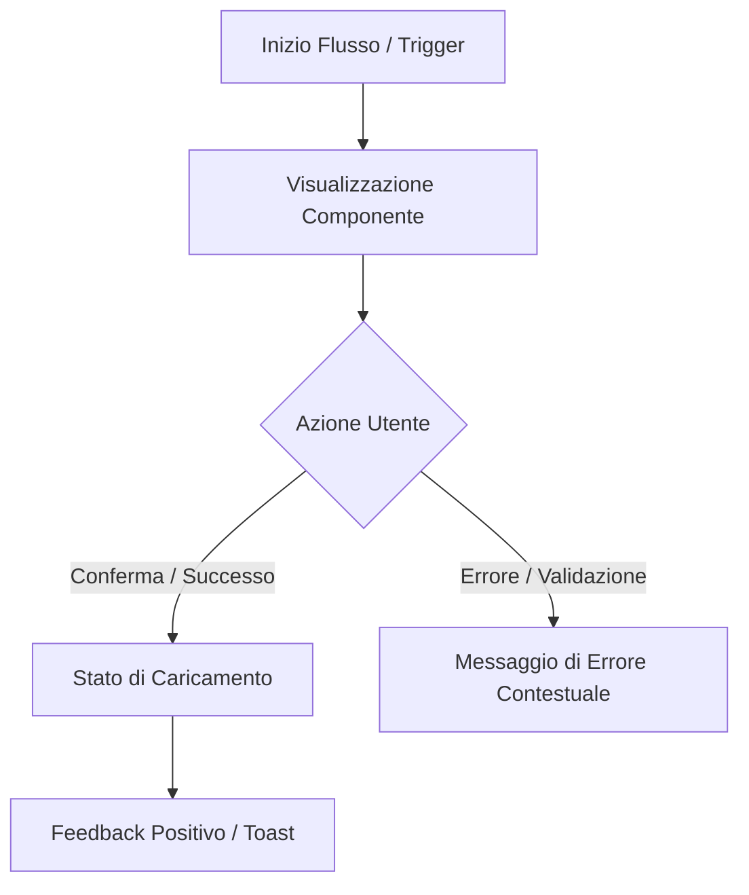

# [Feature Name] - Functional & Design Specifications

> **Status**: `Draft` | `In Review` | `Approved`  
> **Author**: [Name / Role]  
> **Date**: [YYYY-MM-DD]  
> **Target Release / Prototype Milestone**: [v0.1 / Sprint X]

---

## 1. Executive Summary & Obiettivi

### 1.1 Panoramica
Breve descrizione (2-3 frasi) della funzionalità, del problema che risolve e del valore per l'utente.

### 1.2 Obiettivi di Business / UX (Success Metrics)
- **Obiettivo Primario**: [es. Ridurre il tempo di completamento del checkout del 20%]
- **Obiettivo Secondario**: [es. Aumentare l'engagement con i filtri di ricerca]
- **Non-Goals (Out of Scope)**: [Cosa NON è incluso in questo prototipo/rilascio]

---

## 2. User Personas & User Stories

### 2.1 Personas
- **Persona Primaria**: [es. Marco, Power User che gestisce team numerosi]
- **Persona Secondaria**: [es. Chiara, Utente occasionale da mobile]

### 2.2 User Stories
- **US-01**: In qualità di *[ruolo]*, voglio *[azione]* affinché *[beneficio]*.
- **US-02**: In qualità di *[ruolo]*, voglio *[azione]* affinché *[beneficio]*.

---

## 3. User Flow & Architettura delle Informazioni



### 3.1 Passi del Flusso
1. **Trigger**: L'utente clicca su `[...]`.
2. **Interazione**: Si apre il dialog/modal con i campi pre-compilati.
3. **Validazione**: Validazione real-time sui campi input.
4. **Completamento**: Transizione allo stato confermato con aggiornamento dell'UI.

---

## 4. Specifiche Componenti UI & Design System

### 4.1 Componenti Richiesti
| Componente | File Path | Token Principali Utilizzati | Note |
|---|---|---|---|
| `Button` | `src/components/button.css` | `--color-primary`, `--space-3` | Varianti: primary, secondary, ghost |
| `Card` | `src/components/card.css` | `--color-surface`, `--shadow-md` | Con container query per layout fluido |
| `Input` | `src/components/input.css` | `--color-border`, `--radius-md` | Con supporto `:user-valid` / `:user-invalid` |

### 4.2 Matrice degli Stati (Component States)
Ogni componente deve supportare i seguenti stati:
- [x] **Default**: Aspetto a riposo.
- [x] **Hover**: Transizione fluida al passaggio del cursore (`--transition-fast`).
- [x] **Focus-Visible**: Ring di focus visibile e accessibile da tastiera.
- [x] **Active / Pressed**: Feedback visivo di pressione.
- [x] **Disabled**: Opacità ridotta, `pointer-events: none`, `aria-disabled="true"`.
- [x] **Loading**: Skeleton placeholder o spinner con `aria-busy="true"`.
- [x] **Empty State**: Illustrazione/icona e call-to-action chiara.
- [x] **Error State**: Bordo e messaggio semantico con `role="alert"`.

---

## 5. Modello Dati / Mock Data (JSON)

Specificare la struttura dei dati mock utilizzati per il prototipo:

```json
{
  "id": "item_12345",
  "title": "Titolo di Esempio",
  "status": "active",
  "metrics": {
    "views": 1420,
    "conversionRate": 0.048
  },
  "tags": ["Design System", "Prototype", "OKLCH"]
}
```

---

## 6. Edge Cases & Gestione Errori

- **Network Offline / Timeout**: Mostrare banner di avviso con pulsante "Riprova".
- **Testo Estremamente Lungo**: Truncation con tooltip o multiline wrapping senza rompere il grid.
- **Risoluzioni Estreme**: Testare su viewport 320px (mobile) e 2560px (ultra-wide).
- **Contrasto & Dark Mode**: Verificare contrasto minimo 4.5:1 per testo normale.

---

## 7. Criteri di Accettazione (Gherkin Format)

### Scenario 1: Interazione con successo
- **DATO CHE** l'utente si trova nella sandbox
- **QUANDO** clicca sul pulsante di azione primaria
- **ALLORA** il componente deve mostrare lo stato di caricamento e successivamente aggiornare la card.

### Scenario 2: Validazione fallita
- **DATO CHE** il campo di input obbligatorio è vuoto
- **QUANDO** l'utente preme "Invia" o perde il focus (`blur`)
- **ALLORA** deve comparire un messaggio di errore con colore `--color-error` e focus accessibile.

---

## 8. Checklist di Rilascio Prototipo

- [ ] Specifiche approvate dal team di prodotto/design
- [ ] Implementazione dei componenti con soli token `tokens.css`
- [ ] Showcase integrato e navigabile in `src/index.html`
- [ ] Test di navigazione completa con sola tastiera (`Tab`, `Shift+Tab`, `Space`, `Enter`, `Esc`)
- [ ] Test su tema chiaro e scuro
